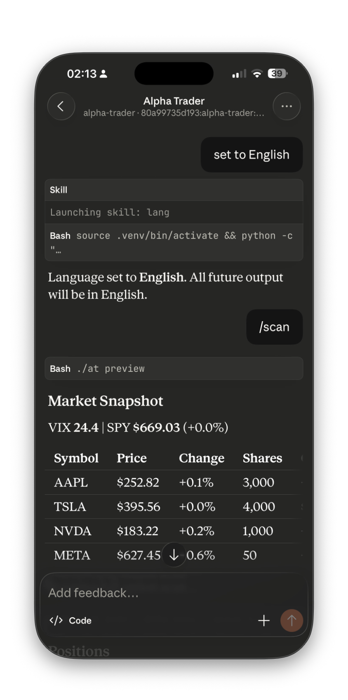
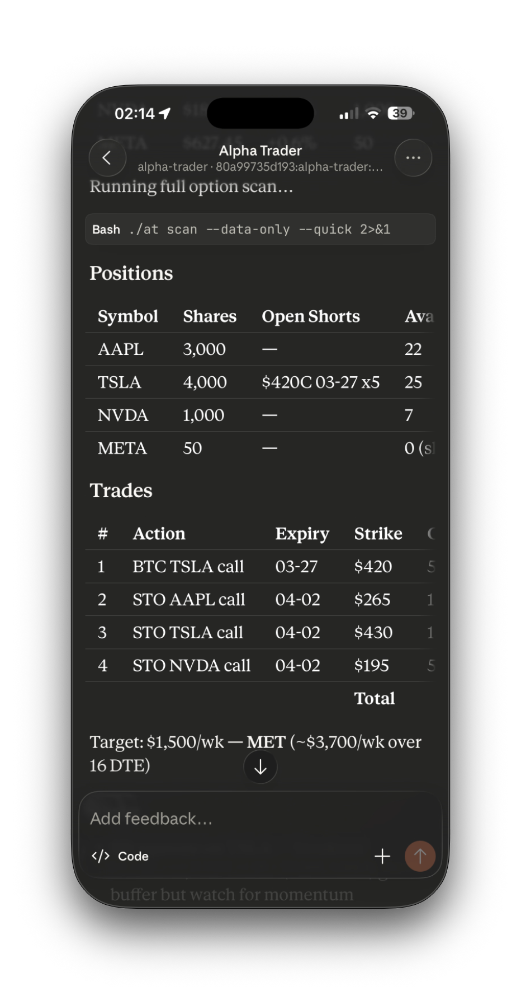

# Alpha Trader `v0.0.1-alpha`

AI-powered covered call & options advisor built on Claude Code. You make the decisions, the tool does three things: **recommend, track, learn**.

No broker API. No auto-execution. You see the action list, trade on Robinhood yourself, come back and record what you did.




> **23 CLI commands** · **5-factor scoring** · **self-learning optimizer** · **ML signals** · **multi-leg strategies** · **Robinhood-style charts** · **web dashboard** · **iOS Remote** · **6 languages**

## Quick Start

```bash
git clone <repo> && cd alpha-trader
python3 -m venv .venv && source .venv/bin/activate
pip install -e .

# Edit your positions
vim config.yaml

# Run your first scan
python -m src.cli scan --data-only --quick
```

## Daily Workflow

```bash
# Morning (8 AM PST)
/daily              # Position advice: HOLD / CLOSE / ROLL / LET EXPIRE
/scan               # Today's covered call candidates, scored and ranked

# You trade on Robinhood, then record it
add-short AMZN 2026-04-17 225 12 1.09

# Midweek check
/monitor            # Quick alert scan (ITM risk, RSI, Bollinger, DTE)

# Friday — expiry management
/daily              # See what's expiring
close-short AMZN 2026-04-17 225 --status expired

# Monthly review
report all          # P&L vs $1,500/wk target
optimize            # Self-learning parameter suggestions
```

## How It Works

```
Yahoo Finance (free)
      ↓
Data Pipeline ── prices, option chains, Greeks, IV, RSI, MACD, BB, ATR,
                  news, insider trades, analyst ratings, unusual activity
      ↓
5-Factor Scoring ── delta proximity + premium richness + theta decay
                     + IV rank + DTE preference (weights auto-tunable)
      ↓
Claude Opus ── analyzes all data, generates concrete action list
      ↓
You ── review, decide, execute on Robinhood
      ↓
Trade Journal (SQLite) ── tracks every trade lifecycle
      ↓
Self-Learning Optimizer ── buckets by delta/DTE/IV, finds what works,
                            nudges parameters toward winning ranges
```

---

## Commands Reference (22 total)

### Scanning & Recommendations

#### `scan` — Full market scan + AI action list
Fetches market data for all portfolio symbols, runs option chain analysis, and generates a ranked list of covered call candidates using Claude Opus.

```bash
python -m src.cli scan                    # Full scan → Claude analysis → action list
python -m src.cli scan --quick            # Fast mode (~3s): skip news/insider/puts, parallel fetch
python -m src.cli scan --data-only        # Raw data briefing only, no Claude analysis
python -m src.cli scan --data-only --quick # Fastest: just the data tables
python -m src.cli scan --notify           # Scan + send result to Telegram
python -m src.cli scan --model claude-sonnet-4-6  # Use a different model
```

**What it outputs:** Market context (VIX, SPY, regime) → per-symbol stock data with technicals (RSI, MACD, BB, ATR) → scored option chain candidates (marked `>>>` for best fit) → Claude's concrete action list with exact strikes, quantities, and premiums.

#### `preview` — Ultra-fast market snapshot
Shows current VIX, SPY, stock prices, and portfolio status in under 2 seconds. Used as the first phase of `/scan` to give you something to read while the full data loads.

```bash
python -m src.cli preview
```

**Output example:**
```
VIX 23.5 | SPY $669.03 (+0.9%)
| Symbol | Price  | Change | Shares | Open Shorts | Avail |
| AAPL   | $211.74| +2.0%  | 3,000  | —           | 22    |
```

#### `daily` — Daily position review
The morning command. Shows every open short call with a specific action recommendation based on configurable rules (profit take %, stop loss, DTE threshold, earnings proximity).

```bash
python -m src.cli daily
```

**Actions it can recommend:**
- `CLOSE_PROFIT` — captured ≥ 50% of max premium (configurable)
- `CLOSE_STOP` — premium rose to ≥ 2x entry (stop loss)
- `ROLL` — ITM with DTE ≤ 5, or DTE approaching threshold
- `LET_EXPIRE` — OTM, DTE ≤ 3, 75%+ profit captured
- `CLOSE_EARNINGS` — earnings announcement before expiry
- `HOLD` — on track, no action needed

#### `roll` — Roll analysis for existing short calls
Detailed analysis of each open short call: whether to hold, close, or roll. If roll is recommended, shows specific roll-to candidates with net credit/debit.

```bash
python -m src.cli roll
```

#### `spreads` — Multi-leg option strategies
Scans for 5 types of multi-leg strategies beyond simple covered calls. Shows max profit, max loss, breakeven, and probability of profit for each candidate.

```bash
python -m src.cli spreads --symbol AAPL                      # All strategies
python -m src.cli spreads --symbol AAPL --strategy bull-put   # Specific strategy
python -m src.cli spreads --symbol AAPL --strategy iron-condor
```

**Supported strategies:**
| Strategy | Description |
|----------|-------------|
| `bull-put` | Sell put + buy lower put. Collect premium with defined downside risk. |
| `bear-call` | Sell call + buy higher call. Collect premium with defined upside risk. |
| `iron-condor` | Bull put spread + bear call spread. Profit from range-bound stock. |
| `collar` | Own stock + buy put + sell call. Protect downside, cap upside. |
| `pmcc` | Poor man's covered call. Buy deep ITM LEAPS + sell OTM call. Leverage. |

---

### Alerts & Monitoring

#### `alerts` — Check all alert conditions
Scans all positions for 8 alert conditions and returns a prioritized list.

```bash
python -m src.cli alerts
python -m src.cli alerts --notify    # Also push to Telegram
```

**Alert types (by severity):**
| Severity | Condition |
|----------|-----------|
| URGENT | DTE ≤ 2 on an open short call (roll now) |
| URGENT | Stock price crossed above short call strike (ITM, assignment risk) |
| URGENT | Stock within 2% of strike (approaching ITM) |
| WARNING | Expired short call still in config (cleanup reminder) |
| WARNING | RSI > 70 — overbought, pullback risk |
| WARNING | Price above Bollinger upper band — overbought signal |
| WARNING | ATR > 4% of price — elevated volatility |
| INFO | RSI < 30 — oversold, potential bounce |
| INFO | Bollinger squeeze (width < 6%) — breakout imminent |

#### `/monitor` (slash command) — Quick alert check
Same as `alerts` but designed to be used from Claude Code Remote (iOS app) or with `/loop 30m /monitor` for periodic monitoring during market hours.

---

### Trade Tracking

#### `add-short` — Record a new short call trade
After you sell a call on Robinhood, record it here. Saves to both `config.yaml` (for scanning) and SQLite (for P&L tracking).

```bash
python -m src.cli add-short AAPL 2026-04-17 225 12 1.09
#                           ^^^^  ^^^^^^^^^^  ^^^ ^^ ^^^^
#                           symbol  expiry   strike contracts premium
```

#### `close-short` — Record trade closure
When a short call expires, you close it early, or you get assigned.

```bash
python -m src.cli close-short AAPL 2026-04-17 225                              # Default: expired worthless
python -m src.cli close-short AAPL 2026-04-17 225 --status closed --close-price 0.45  # Bought to close at $0.45
python -m src.cli close-short AAPL 2026-04-17 225 --status assigned            # Got assigned (called away)
```

#### `update-position` — Update share count
When your share count changes (RSU vest, buy/sell, assignment).

```bash
python -m src.cli update-position AAPL 3000
python -m src.cli update-position AAPL 2900 --cost-basis 180.0
```

#### `report` — P&L reports
Shows premium collected vs weekly target, broken down by week or month.

```bash
python -m src.cli report              # Last 8 weeks
python -m src.cli report weekly       # Same
python -m src.cli report monthly      # Last 6 months
python -m src.cli report all          # Full history: weekly + monthly + cumulative stats
```

**Shows:** Premium collected per period, % of target achieved, win/loss count, open trade details, cumulative stats (total premium, realized P&L, trade breakdown by status).

---

### Analysis & Research

#### `backtest` — Historical strategy simulation
Simulates weekly covered call selling over historical data using Black-Scholes pricing. Estimates how the strategy would have performed.

```bash
python -m src.cli backtest                                          # Default: AAPL,TSLA, 12 months, delta 0.20, DTE 7
python -m src.cli backtest --symbol AAPL --months 6 --delta 0.15    # Custom
python -m src.cli backtest --symbol AAPL,TSLA --weekly              # Show week-by-week detail
```

**Output:** Total premium, avg weekly premium, number of assignments, win rate, stock return vs strategy return, annualized return, max drawdown.

#### `correlation` — Position correlation & beta
Analyzes how correlated your positions are (diversification check) and each stock's beta to SPY.

```bash
python -m src.cli correlation
```

**Output example:**
```
| Pair      | 6mo Corr | 30d Corr | Diversification |
| AAPL/TSLA | 0.299    | 0.012    | GOOD            |

| Symbol | Beta to SPY |
| AAPL   | 1.46        |
```

#### `earnings-crush` — Earnings IV crush analysis
Analyzes historical implied volatility behavior around earnings dates. Helps decide whether to sell options before earnings (capture vol crush) or avoid (gap risk).

```bash
python -m src.cli earnings-crush --symbol AAPL
python -m src.cli earnings-crush --symbol AAPL,TSLA
```

#### `spark` — Inline sparkline chart (for CC Remote)
Unicode-based mini charts that render directly in the Claude Code conversation — no browser needed. Shows price trend, RSI bar, MACD direction, volume profile, 52-week position, and short call strike distances.

```bash
./at spark --symbol AAPL           # Single symbol
./at spark                         # All portfolio symbols
./at spark --period 6mo            # Longer lookback
```

#### `chart` — Robinhood-style interactive chart
Full candlestick chart with technical overlays, trade markers, and short call strike lines. Pure black background, Robinhood green/red colors, period selector (1D/1W/1M/3M/1Y/ALL), line↔candle toggle, indicator toggles (SMA/BB/RSI/MACD/VOL).

```bash
./at chart --symbol AAPL                             # Opens in browser
./at chart --symbol AAPL --period 6mo                # Custom period
./at chart --symbol AAPL --indicators sma,rsi,macd   # Custom indicators
./at chart --symbol AAPL --no-open                   # Generate file + show dashboard URL
```

Also accessible via dashboard: `http://127.0.0.1:8080/chart/AAPL`

#### `iv-surface` — IV surface visualization
Generates interactive 3D IV surface (strike × DTE × implied volatility) as a standalone HTML file using Plotly.js. Opens in browser.

```bash
python -m src.cli iv-surface --symbol AAPL             # Full 3D surface + 2D smile
python -m src.cli iv-surface --symbol AAPL --smile      # 2D IV smile only (nearest expiry)
python -m src.cli iv-surface --symbol AAPL --no-open    # Generate without opening browser
```

#### `margin` — Portfolio margin summary
Shows margin requirements for all positions and calculates capital efficiency.

```bash
python -m src.cli margin
python -m src.cli margin --optimize --target 1500    # Suggest most capital-efficient strategy mix
```

---

### Machine Learning

#### `ml train` — Train ML model
Trains a GradientBoosting classifier on 24 months of historical data to predict whether it's a good week to sell calls. Uses 14 features (RSI, MACD, BB, ATR, IV rank, VIX, earnings proximity, etc.) with TimeSeriesSplit cross-validation to prevent lookahead bias.

```bash
python -m src.cli ml train                          # Default: 24 months, delta 0.20, DTE 7
python -m src.cli ml train --months 12 --delta 0.15 # Custom
```

**Output:** Accuracy, precision, recall, and feature importance ranking. Model saved to `data/ml_model.joblib`.

#### `ml predict` — Current ML signals
Loads the trained model and generates a signal for each portfolio symbol.

```bash
python -m src.cli ml predict
```

**Signals:**
- `BUY_SIGNAL` (≥65% confidence) — conditions favor selling calls this week
- `NEUTRAL` (45-65%) — mixed signals, proceed with normal strategy
- `CAUTION` (<45%) — unfavorable conditions, consider waiting or reducing size

#### `ml features` — Feature inspection
Shows the current value of all 14 ML features for a symbol. Useful for understanding what's driving the signal.

```bash
python -m src.cli ml features --symbol AAPL
```

---

### Self-Learning

#### `optimize` — Strategy parameter optimizer
Analyzes your closed trade history, buckets by delta/DTE/IV rank, finds which parameter ranges produced the best win rate and P&L, then suggests bounded adjustments (max 15% change per cycle).

```bash
python -m src.cli optimize              # Show suggestions
python -m src.cli optimize --apply      # Apply suggestions to config.yaml
```

**What it tunes:** `target_delta`, `preferred_dte`, `profit_take_pct`, and scoring weights. All changes logged to `data/optimizer_log.json`. Triggered automatically after every 20 closed trades (you'll see a reminder in `/daily`).

---

### Paper Trading

#### `paper` — Alpaca paper trading
Validate trade ideas against Alpaca's paper trading environment before executing on Robinhood. Requires free Alpaca account (set `ALPACA_API_KEY` and `ALPACA_SECRET_KEY` in `.env`).

```bash
python -m src.cli paper status                                    # Account balance + positions
python -m src.cli paper chain AAPL 2026-04-17                     # View option chain with Greeks
python -m src.cli paper submit AAPL 2026-04-17 225 12 1.09        # Sell 12x AAPL 4/17 $225C @ $1.09
python -m src.cli paper close AAPL 2026-04-17 225 12 0.45         # Buy to close
python -m src.cli paper orders                                    # List open orders
python -m src.cli paper cancel <order_id>                         # Cancel an order
```

---

### Web Dashboard

#### `dashboard` — Launch web UI
Dark-themed trader terminal dashboard with real-time SSE price streaming, Chart.js weekly premium chart, position tables, and trade history.

```bash
python -m src.cli dashboard                     # http://127.0.0.1:8080
python -m src.cli dashboard --port 3000         # Custom port
```

**Features:** VIX/SPY header with live updates (30s SSE), regime badge, portfolio positions, open short calls with DTE countdown bars, weekly premium chart vs target, trade history, "Scan Now" button.

---

### Notifications & Scheduling

#### `notify` — Telegram push
Send the latest scan report to Telegram. Requires bot token (see `.env.example`).

```bash
python -m src.cli notify --test    # Test connection
python -m src.cli notify           # Send latest report
```

#### `bot` — Interactive Telegram bot
Long-polling daemon. Responds to `/scan`, `/data`, `/positions`, `/roll`, `/help` from your phone.

```bash
python -m src.cli bot
```

#### `cron` — Scheduled auto-scans
Install cron jobs to run scans automatically Monday–Friday at 8 AM and 12 PM PST.

```bash
python -m src.cli cron install     # Set up cron jobs
python -m src.cli cron status      # Check what's installed
python -m src.cli cron remove      # Remove cron jobs
```

---

## Access from iPhone

```bash
# Start Claude Code Remote Control (requires Claude Max subscription)
./scripts/start-remote.sh

# Press SPACE to show QR code → scan with iPhone → Claude iOS app
# Then type /scan, /daily, /monitor from your phone
```

## Strategy

**Covered call selling** on existing stock positions (RSU), plus multi-leg strategies for advanced setups.

The system auto-selects market regime based on VIX:

| VIX | Regime | Delta Range | Approach |
|-----|--------|-------------|----------|
| < 15 | Conservative | 0.08 – 0.15 | Tighter strikes, less premium, minimal assignment |
| 15-25 | Balanced | 0.15 – 0.25 | Good premium vs safety tradeoff |
| > 25 | Aggressive | 0.25 – 0.35 | Fat premiums, accept higher assignment risk |

### 5-Factor Scoring Model

Every option candidate is scored:

```
score = delta_proximity × 0.30    ← how close to your target delta
      + premium_richness × 0.25   ← annualized yield relative to peers
      + theta_decay      × 0.20   ← daily time decay efficiency
      + iv_rank          × 0.15   ← selling when IV is historically rich
      + dte_preference   × 0.10   ← how close to your preferred DTE
```

Weights auto-tune via the optimizer based on which factors correlate most with your profitable trades.

### Self-Learning Loop

```
Close 20 trades → optimizer triggers
      ↓
Bucket by delta / DTE / IV rank
      ↓
Find best win rate + avg P&L ranges
      ↓
Bounded nudge (max 15% per cycle)
      ↓
You confirm → config.yaml updates
      ↓
Next /scan uses improved parameters
```

## Data Sources (all free, no API keys required)

| Source | Data |
|--------|------|
| Yahoo Finance | Prices, option chains, IV, earnings dates, news, insider trades, analyst ratings |
| Black-Scholes | IV solver for accurate Greeks even off-hours/weekends |
| Computed | RSI-14, MACD (12,26,9), Bollinger Bands (20,2), ATR-14, IV rank/percentile |
| Enhanced | Unusual options activity, put/call ratio, sector rotation (XLK/SPY/QQQ), institutional holdings |
| Alpaca (optional) | Real-time option chains with Greeks for paper trading validation |

## Project Structure

```
alpha-trader/
├── config.yaml              # Positions + strategy params (you maintain)
├── .env                     # Telegram + Alpaca credentials (not committed)
├── data/
│   ├── trades.db            # Trade history (SQLite, auto-created)
│   ├── ml_model.joblib      # Trained ML model
│   └── optimizer_log.json   # Parameter change audit trail
├── src/
│   ├── cli.py               # 23 CLI commands
│   ├── config.py            # Config loader + language switching
│   ├── strategy.py          # 5-factor scoring model + position management rules
│   ├── optimizer.py         # Self-learning parameter tuner
│   ├── db.py                # SQLite trade journal
│   ├── report.py            # Briefing generator (structured markdown for Claude)
│   ├── roll.py              # Roll analysis engine
│   ├── alerts.py            # 8 alert conditions (DTE, ITM, RSI, BB, ATR)
│   ├── analytics.py         # Correlation, earnings crush, tax lots, P&L attribution
│   ├── backtest.py          # Historical covered call simulation
│   ├── multileg.py          # Multi-leg strategies (spreads, condors, collars)
│   ├── margin.py            # Portfolio margin calculation + optimization
│   ├── ml_signals.py        # ML signal generation (GradientBoosting)
│   ├── charts.py            # Robinhood-style interactive candlestick charts (Plotly.js)
│   ├── sparkline.py         # Unicode sparkline charts (inline in CC Remote)
│   ├── iv_surface.py        # 3D IV surface + 2D smile visualization
│   ├── paper.py             # Alpaca paper trading integration
│   ├── dashboard.py         # Web UI (Flask + Chart.js + SSE streaming + chart routes)
│   ├── notify.py            # Telegram push notifications
│   ├── bot.py               # Interactive Telegram bot
│   └── data/
│       ├── fetcher.py       # Yahoo Finance data pipeline + technicals
│       ├── greeks.py        # Black-Scholes pricing + IV solver
│       ├── news.py          # News, insider transactions, analyst ratings
│       └── enhanced.py      # Unusual activity, P/C ratio, sector, institutional
├── .claude/skills/
│   ├── covered-call-policy/ # /scan — daily action list
│   ├── monitor/             # /monitor — alert check
│   └── lang/                # /lang — output language switching
├── scripts/
│   ├── start-remote.sh      # Claude Code Remote (iOS via tmux)
│   └── cron_scan.sh         # Scheduled scans with notification
└── reports/                 # Generated reports, IV surface HTML files
```

## Language Support

```
/lang en      English (default)
/lang zh      简体中文
/lang zh-tw   繁體中文
/lang es      Español
/lang ja      日本語
/lang ko      한국어
```

## Security Notes

**Data flow awareness**: When using `/scan`, your portfolio data (share counts, short calls, weekly target) is sent to Claude's API for analysis. When using Telegram bot/notify, reports are sent to Telegram servers. This is by design — Claude needs your data to generate recommendations. If you need to keep portfolio info strictly local, use `--data-only` mode and analyze manually.

**Dashboard auth**: When exposing dashboard on LAN (`0.0.0.0`), set `DASHBOARD_TOKEN` in `.env` to require token-based access. Without it, anyone on your network can see your positions.

**No secrets in git**: `.env`, `data/trades.db` (and WAL/SHM sidecars), `ml_model.joblib`, and `optimizer_log.json` are all gitignored.

## Changelog

### v0.0.1-alpha (2026-03-17)

Initial release. Built in a single Claude Code session.

- 23 CLI commands covering scan, trade tracking, analysis, visualization, and automation
- 5-factor scoring model with configurable weights
- Self-learning optimizer (bounded nudge, 15% max per cycle, human-in-the-loop)
- GradientBoosting ML signals (14 features, TimeSeriesSplit cross-validation)
- Technical indicators: RSI-14, MACD, Bollinger Bands, ATR-14
- Black-Scholes IV solver for accurate off-hours Greeks
- Multi-leg strategies: bull put spread, bear call spread, iron condor, collar, PMCC
- Robinhood-style interactive charts (Plotly.js) + Unicode sparkline inline charts
- 3D IV surface visualization
- Web dashboard with SSE real-time streaming
- Claude Code Remote integration (iOS app via tmux)
- Telegram bot (push + interactive)
- Alpaca paper trading integration
- SQLite trade journal with P&L reports
- Historical backtesting engine
- Portfolio correlation analysis + margin optimization
- Cron scheduling (8AM + 12PM PST)
- 6 output languages (en/zh/zh-tw/es/ja/ko)
- Token-based dashboard auth for LAN exposure
- All data from free sources (Yahoo Finance), no API keys required

## License

MIT
